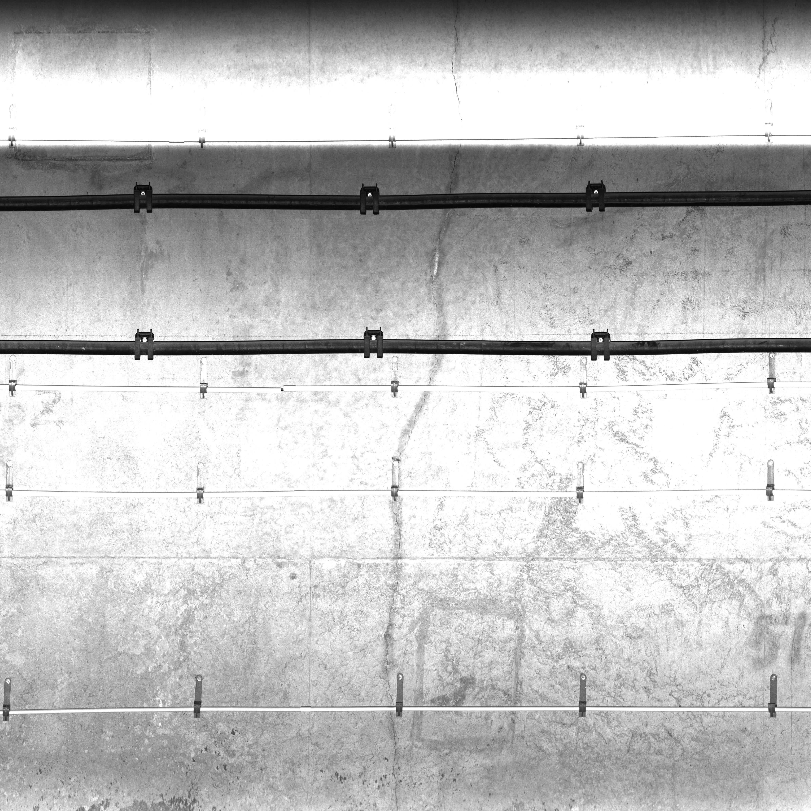
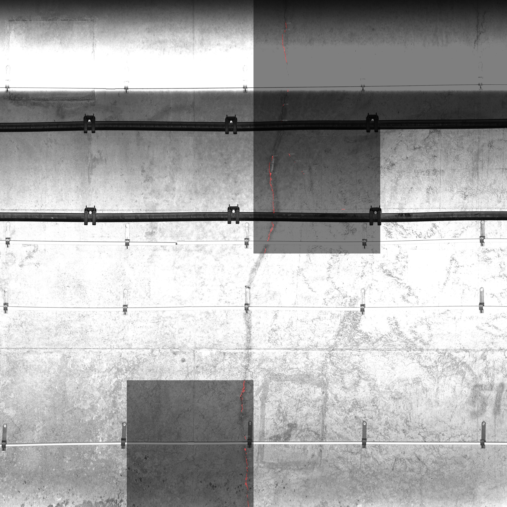

# Industrial Wall Crack Detection and Width Measurement

This respository contains a crack segmentation model using UNet and an edge detection method to enhance the precision, as well as a width measurement employing the inscribed circle algorithm.

One sample using our methods are as follows:

| Original image | Measurement |
| :----: | :----: |
|||

## Usage

Before usage, place the pth weight file in the `pth` directory and place the images to be recognized in the `data` directory. Additionally, ensure the installation of the required dependencies.

Run `predict.py` to execute the inference.

## Reference

https://github.com/bubbliiiing/unet-pytorch